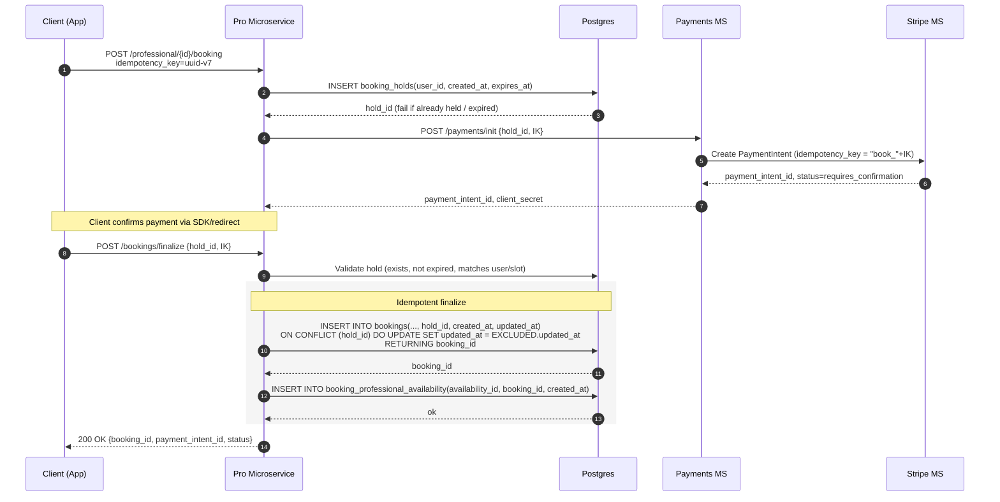

# Temporary Notes on how to create payments:
How to design idempotency for payments

- client will call pro microservice for booking/payments
- booking_holds record is created
- payment microservice is called
- payment microservice calls stripe microservice
- payment microservice return responses back to pro microservice with payment_intent_id
- final bookings record is created inside pro microservice
- final response is back to the client

mermaid flowchart (WIP):

